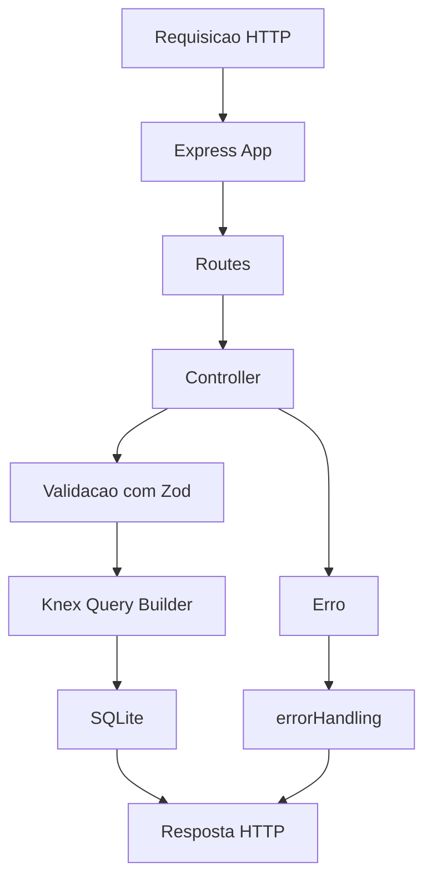

# gerenciamneto-biblioteca-api


> API REST para gerenciamento de uma biblioteca. Permite cadastrar, listar, atualizar e remover livros, alem de registrar emprestimos e devolucoes. Construida com Node.js, Express, TypeScript, SQLite, Knex, Zod e documentacao Swagger.

---

## Rotas da Aplicacao

### `/livros`

<details>
<summary>POST <code>/livros</code> - Criar livro</summary>

Cadastra um novo livro no acervo.

**Body (JSON):**

```json
{
  "titulo": "O Hobbit",
  "autor": "J.R.R. Tolkien",
  "genero": "Fantasia"
}
```

</details>

<details>
<summary>GET <code>/livros</code> - Listar livros</summary>

Retorna todos os livros cadastrados.

**Query Parameters:**

- `genero` opcional: filtra os livros por genero.

**Exemplo:**

```http
GET /livros?genero=Fantasia
```

</details>

<details>
<summary>GET <code>/livros/:id</code> - Buscar livro por ID</summary>

Retorna os dados de um livro especifico.

**Parametros de rota:**

- `id`: ID do livro.

</details>

<details>
<summary>PATCH <code>/livros/:id</code> - Atualizar livro</summary>

Atualiza as informacoes de um livro existente.

**Parametros de rota:**

- `id`: ID do livro.

**Body (JSON):**

```json
{
  "titulo": "O Hobbit",
  "autor": "J.R.R. Tolkien",
  "genero": "Fantasia"
}
```

> Todos os campos sao opcionais, mas pelo menos um campo deve ser enviado.

</details>

<details>
<summary>DELETE <code>/livros/:id</code> - Remover livro</summary>

Remove um livro do acervo.

**Parametros de rota:**

- `id`: ID do livro.

> Um livro com emprestimo ativo nao pode ser removido.

</details>

### `/emprestimos`

<details>
<summary>POST <code>/emprestimos</code> - Criar emprestimo</summary>

Registra um novo emprestimo para um livro disponivel.

**Body (JSON):**

```json
{
  "livroId": 1,
  "nomeAluno": "Maria Silva"
}
```

> Ao criar um emprestimo, o livro fica indisponivel.

</details>

<details>
<summary>GET <code>/emprestimos</code> - Listar emprestimos ativos</summary>

Retorna todos os emprestimos que ainda nao foram devolvidos.

</details>

<details>
<summary>PATCH <code>/emprestimos/:id/devolver</code> - Devolver livro</summary>

Marca um emprestimo como devolvido.

**Parametros de rota:**

- `id`: ID do emprestimo.

> Ao devolver um emprestimo, o livro volta a ficar disponivel.

</details>

### `/api-docs`

<details>
<summary>GET <code>/api-docs</code> - Documentacao Swagger</summary>

Abre a documentacao interativa da API.

**URL local:**

```text
http://localhost:3000/api-docs
```

</details>

---

## Funcionalidades

| Funcionalidade | Descricao |
| --- | --- |
| Cadastrar livro | Cria livros com titulo, autor e genero |
| Listar livros | Retorna todos os livros cadastrados |
| Filtrar por genero | Filtra livros usando query parameter |
| Buscar por ID | Retorna um livro especifico |
| Atualizar livro | Altera dados de um livro existente |
| Remover livro | Remove livros sem emprestimo ativo |
| Criar emprestimo | Registra emprestimo de livro disponivel |
| Listar emprestimos ativos | Mostra apenas emprestimos nao devolvidos |
| Devolver livro | Marca emprestimo como devolvido e libera o livro |
| Validar dados | Usa Zod para validar body, params e query |
| Documentar API | Usa Swagger para documentacao interativa |
| Persistir dados | Usa SQLite com Knex Query Builder |

---

## Tecnologias Utilizadas

<div align="center">
  
  
  
  
  
  
  
</div>

---

## Conceitos Aplicados

- API REST com Express
- TypeScript com tipagem estatica
- Controllers com classes
- Rotas separadas por recurso
- Middleware unico para tratamento de erros
- Validacao de dados com Zod
- Persistencia com SQLite
- Query Builder com Knex
- Migrations simples executadas ao iniciar o servidor
- Documentacao interativa com Swagger
- CORS habilitado
- Separacao entre app, server, routes, controllers, data, docs, middlewares e utils

---

## Como Rodar o Projeto

```bash
# Clonar o repositorio
git clone https://github.com/DanielVerissimo1/gerenciamneto-biblioteca-api

# Entrar na pasta do projeto
cd gerenciamneto-biblioteca-api

# Instalar dependencias
npm install

# Iniciar em modo desenvolvimento
npm run dev
```

O servidor estara disponivel em:

```text
http://localhost:3000
```

A documentacao Swagger estara disponivel em:

```text
http://localhost:3000/api-docs
```

---

## Scripts Disponiveis

| Script | Descricao |
| --- | --- |
| `npm run dev` | Inicia o servidor em desenvolvimento com `ts-node-dev` |
| `npm run build` | Compila o projeto TypeScript para a pasta `dist` |
| `npm start` | Executa a versao compilada em `dist/server.js` |

---

## Banco de Dados

O projeto usa SQLite. O arquivo do banco e criado automaticamente em:

```text
data/biblioteca.sqlite
```

As tabelas tambem sao criadas automaticamente ao iniciar o servidor:

- `livros`
- `emprestimos`

---

## Fluxo da Aplicacao



---

## Arquitetura do Projeto

```text
gerenciamneto-biblioteca-api/
|
|-- data/
|   |-- biblioteca.sqlite
|
|-- src/
|   |-- controllers/
|   |   |-- emprestimos.controller.ts
|   |   |-- livros.controller.ts
|   |
|   |-- data/
|   |   |-- database.ts
|   |   |-- migrations/
|   |       |-- 001_create_livros.ts
|   |       |-- 002_create_emprestimos.ts
|   |       |-- index.ts
|   |
|   |-- docs/
|   |   |-- swagger.ts
|   |
|   |-- middlewares/
|   |   |-- error-handling.ts
|   |
|   |-- routes/
|   |   |-- emprestimos.routes.ts
|   |   |-- index.ts
|   |   |-- livros.routes.ts
|   |
|   |-- utils/
|   |   |-- AppError.ts
|   |
|   |-- app.ts
|   |-- server.ts
|
|-- .gitignore
|-- package.json
|-- package-lock.json
|-- README.md
|-- tsconfig.json
```

---

## Autor

Feito por **Daniel Verissimo**
