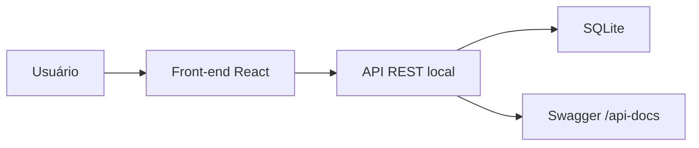

<div align="center">

# API Para Gerenciamento de Biblioteca

  <p>
    
    
    
    
    
    
    
  </p>
</div>

**API Para Gerenciamento de Biblioteca** é o **back-end** de um projeto **fullstack** para controle de acervo e empréstimos. A API foi construída com **Node.js**, **Express**, **TypeScript**, **SQLite**, **Knex**, **Zod** e **Swagger**, fornecendo as rotas consumidas pelo front-end React do sistema.

Ela permite cadastrar, listar, buscar, atualizar e remover livros, além de registrar empréstimos, controlar devoluções e manter a disponibilidade dos livros no banco de dados local.

---

## Projeto Fullstack

Este repositório faz parte de um sistema dividido em duas aplicações:

| Camada | Repositório | Responsabilidade |
|--------|-------------|------------------|
| **Back-end / API** | [gerenciamneto-biblioteca-api](https://github.com/DanielVerissimo1/gerenciamneto-biblioteca-api) | Regras de negócio, rotas REST, validação, SQLite e Swagger |
| **Front-end** | [gerenciamento-biblioteca-front-end](https://github.com/DanielVerissimo1/gerenciamento-biblioteca-front-end) | Interface web para dashboard, livros, empréstimos e devoluções |

O fluxo entre os projetos funciona assim:



Para usar o sistema completo, esta API deve estar em execução localmente em `http://localhost:3000`, que é a URL consumida pelo front-end.

---

## Funcionalidades

| Funcionalidade | Descrição |
|----------------|-----------|
| **Cadastrar livro** | Cria livros com título, autor, gênero e disponibilidade inicial |
| **Listar livros** | Retorna todos os livros cadastrados no acervo |
| **Filtrar por gênero** | Lista livros por gênero usando query parameter |
| **Buscar livro por ID** | Retorna os dados de um livro específico |
| **Atualizar livro** | Altera título, autor ou gênero de um livro existente |
| **Remover livro** | Remove livros sem empréstimo ativo |
| **Criar empréstimo** | Registra empréstimo de um livro disponível para um aluno |
| **Listar empréstimos ativos** | Retorna os empréstimos que ainda não foram devolvidos |
| **Devolver livro** | Marca o empréstimo como devolvido e libera o livro novamente |
| **Validar dados** | Usa Zod para validar body, params e query |
| **Persistir dados** | Usa SQLite com Knex Query Builder |
| **Documentar API** | Expõe documentação interativa com Swagger em `/api-docs` |

---

## Como Rodar o Projeto

```bash
# Clonar o repositório
git clone https://github.com/DanielVerissimo1/gerenciamneto-biblioteca-api

# Entrar na pasta do projeto
cd gerenciamneto-biblioteca-api

# Instalar dependências
npm install

# Iniciar em modo desenvolvimento
npm run dev
```

O servidor ficará disponível em:

```text
http://localhost:3000
```

A documentação Swagger ficará disponível em:

```text
http://localhost:3000/api-docs
```

---

## Integração com o Front-end

Esta API é consumida pelo repositório [DanielVerissimo1/gerenciamento-biblioteca-front-end](https://github.com/DanielVerissimo1/gerenciamento-biblioteca-front-end).

No front-end, a URL da API está configurada localmente em `src/services/api.ts`:

```ts
export const API_BASE_URL = "http://localhost:3000";
```

Por isso, para usar a aplicação completa, rode primeiro esta API e depois inicie o front-end.

---

## Rotas da Aplicação

### `/livros`

<details>
<summary>POST <code>/livros</code> - Criar livro</summary>

Cadastra um novo livro no acervo.

**Body (JSON):**

```json
{
  "titulo": "O Hobbit",
  "autor": "J.R.R. Tolkien",
  "genero": "Fantasia"
}
```

</details>

<details>
<summary>GET <code>/livros</code> - Listar livros</summary>

Retorna todos os livros cadastrados.

**Query Parameters:**

- `genero` opcional: filtra os livros por gênero.

**Exemplo:**

```http
GET /livros?genero=Fantasia
```

</details>

<details>
<summary>GET <code>/livros/:id</code> - Buscar livro por ID</summary>

Retorna os dados de um livro específico.

**Parâmetros de rota:**

- `id`: ID do livro.

</details>

<details>
<summary>PATCH <code>/livros/:id</code> - Atualizar livro</summary>

Atualiza as informações de um livro existente.

**Parâmetros de rota:**

- `id`: ID do livro.

**Body (JSON):**

```json
{
  "titulo": "O Hobbit",
  "autor": "J.R.R. Tolkien",
  "genero": "Fantasia"
}
```

> Todos os campos são opcionais, mas pelo menos um campo deve ser enviado.

</details>

<details>
<summary>DELETE <code>/livros/:id</code> - Remover livro</summary>

Remove um livro do acervo.

**Parâmetros de rota:**

- `id`: ID do livro.

> Um livro com empréstimo ativo não pode ser removido.

</details>

### `/emprestimos`

<details>
<summary>POST <code>/emprestimos</code> - Criar empréstimo</summary>

Registra um novo empréstimo para um livro disponível.

**Body (JSON):**

```json
{
  "livroId": 1,
  "nomeAluno": "Maria Silva"
}
```

> Ao criar um empréstimo, o livro fica indisponível.

</details>

<details>
<summary>GET <code>/emprestimos</code> - Listar empréstimos ativos</summary>

Retorna todos os empréstimos que ainda não foram devolvidos.

</details>

<details>
<summary>PATCH <code>/emprestimos/:id/devolver</code> - Devolver livro</summary>

Marca um empréstimo como devolvido.

**Parâmetros de rota:**

- `id`: ID do empréstimo.

> Ao devolver um empréstimo, o livro volta a ficar disponível.

</details>

### `/api-docs`

<details>
<summary>GET <code>/api-docs</code> - Documentação Swagger</summary>

Abre a documentação interativa da API.

**URL local:**

```text
http://localhost:3000/api-docs
```

</details>

---

## Banco de Dados

O projeto usa SQLite. O arquivo do banco é criado automaticamente em:

```text
data/biblioteca.sqlite
```

As tabelas também são criadas automaticamente ao iniciar o servidor:

- `livros`
- `emprestimos`

---

## Fluxo da API


---

## Arquitetura do Projeto

O projeto é organizado em camadas simples para separar rotas, regras de negócio, banco de dados e tratamento de erros:

| Pasta | Responsabilidade |
|-------|------------------|
| `src/controllers` | Regras de cada recurso e respostas HTTP |
| `src/routes` | Definição das rotas da API |
| `src/data` | Conexão com SQLite e migrations |
| `src/docs` | Configuração da documentação Swagger |
| `src/middlewares` | Tratamento centralizado de erros |
| `src/utils` | Utilitários como `AppError` |

---

## Scripts Disponíveis

| Script | Descrição |
|--------|-----------|
| `npm run dev` | Inicia o servidor em desenvolvimento com `ts-node-dev` |
| `npm run build` | Compila o projeto TypeScript para a pasta `dist` |
| `npm start` | Executa a versão compilada em `dist/server.js` |

---

## Autor

Feito por **Daniel Verissimo**
